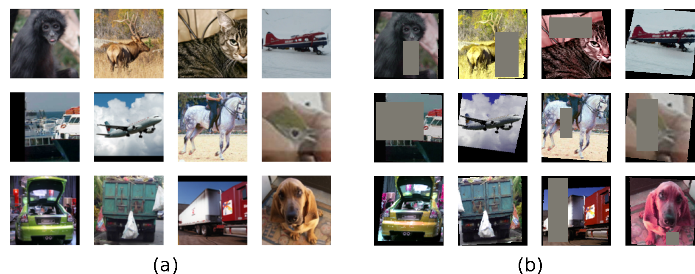
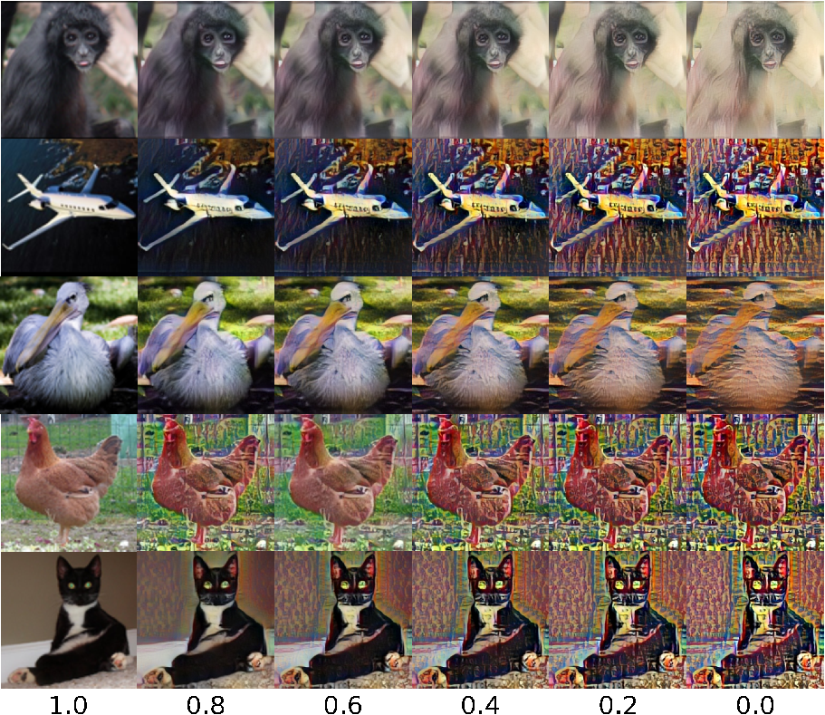
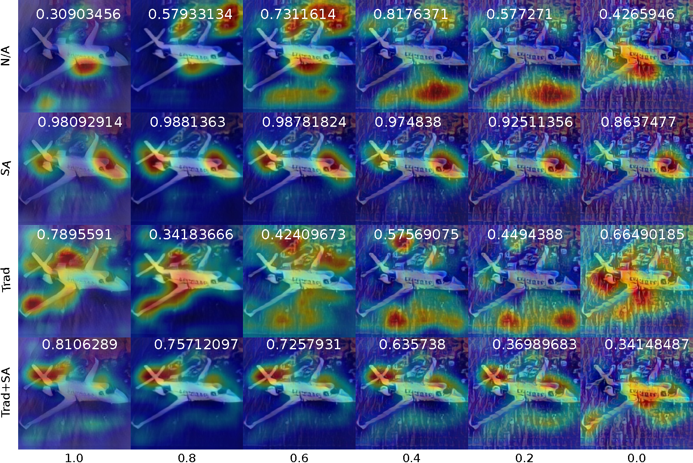
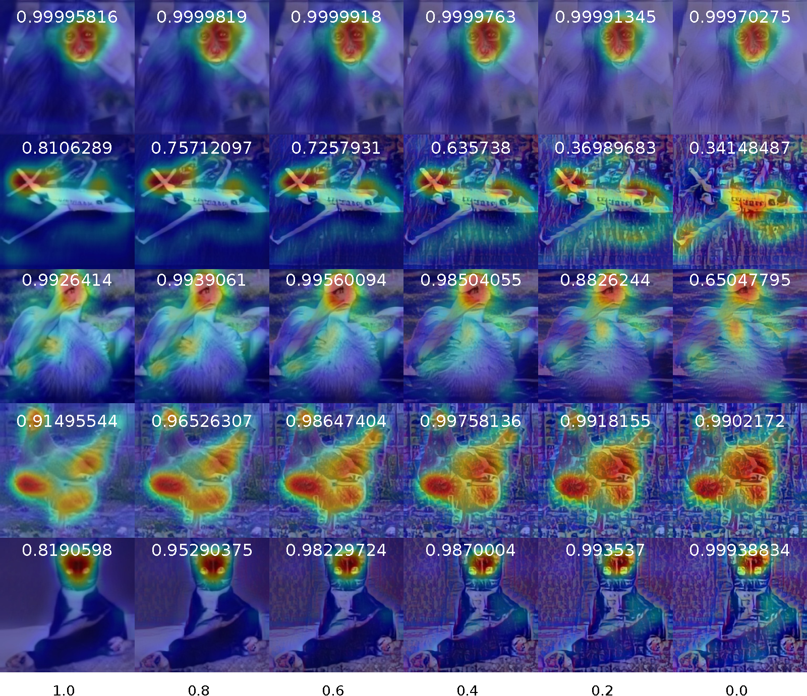
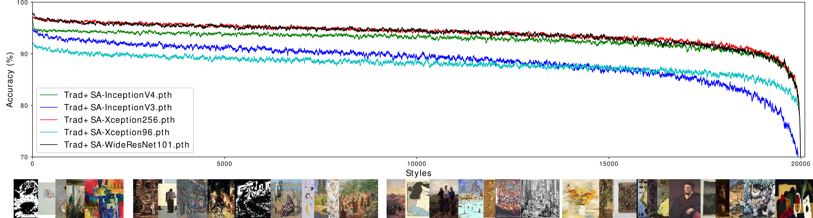

# Understanding-style-augmentation
** The full code will be released after publication acceptation **
## Some other Qualitative Results.
This section could be considered as supplementary material. some qualitative results are presented as following:

{:height="25%" width="25%"}
(a) Traditional Augmentation vs (b) Style Augmentation (plus cutout)

{:height="25%" width="25%"}
Style Augmentation using different alpha values

{:height="25%" width="25%"}
CAMs over all models. Regions highlighted to represent the learned features correlated to the prediction on one sample using all models (separated in each row) presented using None, Trad, SA and Trad+SA augmentations (separated in each column).

{:height="25%" width="25%"}
CAMs over WideResNet model. CAMs highlighted representative the learned features for the model WideResNet trained using N/A, Trad, SA and Trad+SA tested in one styled image with different alpha.

{:height="25%" width="25%"}
CAMs over WideResNet model using styled inputs. Results of applying the CAM technique to WideResNet using different styles and different values for alpha.


Comparison of all models robustness under augmentation style setting. Accuracy vs style transfer (alpha=0.5) for a subset of 100 samples from the test set.


## Code Introduction 
Understanding style augmentation and its influence in image classification

- We used different models Xception InceptionV3, WideResNet and InceptionV4 as classifier networks.
- We trained our styling nets using the pre-trained weights "r41" downloaded from [Learning Linear Transformations for Fast Image and Video Style Transfer] saving the embedded features in the same manner as the original style tranfer paper (however, pretrained methods are available for the stylizing network). To do that, I we changed internal layers and math equations (as detailed on paper) to all these train models.


## Usage
All parameters are detailed in `main.py` and `config_classification.py`, just download the [wikiArt (training) DB](https://www.kaggle.com/c/painter-by-numbers/data) and set it on a folder called Database, the pretrained The model for stylization from [original authors](https://drive.google.com/file/d/1H9T5rfXGlGCUh04DGkpkMFbVnmscJAbs/view) or you can follow the author's procedure to get the model, thereafter move the model into models folder. Finally, run the training code.:


```
python FeatureExtractor.py # To get the feature vectors from WikiArt DB. It takes some time.
```
you should see this file: features_r41.p

```
python AugmentedTest.py # To get some simple qualitative results.
```
Training the model using the config file. hyperparameters can be edited in the `config_classification.py`
```
python training.py
```


### Results

Results reported on Xception and InceptionV4 using STL-10 for classfication task are the following: 

| Netwrok            |    Trad   |   Style   |  Accuracy  | 
| ----------------   | --------- | --------- | ---------- |
| Xception (96)      |           |           |   67.91%   |
| Xception           |     X     |           |   83.65%   |
| Xception           |           |     X     |   69.21%   |
| Xception           |     X     |     X     |   82.67%   |
| InceptionV3 (299)  |           |           |   79.17%   |
| InceptionV3        |     X     |           |   86.49%   |
| InceptionV3        |           |     X     |   80.52%   |
| InceptionV3        |     X     |     X     |   87.18%   |
| InceptionV4 (299)  |           |           |   74.08%   |
| InceptionV4        |     X     |           |   85.34%   |
| InceptionV4        |           |     X     |   77.58%   |
| InceptionV4        |     X     |     X     |   86.28%   |
| Xception (256)     |           |           |   72.14%   |
| Xception           |     X     |           |   86.85%   |
| Xception           |           |     X     |   74.67%   |
| Xception           |     X     |     X     |   86.85%   |
| WideResNet (96)    |           |           |   77.28%   |
| WideResNet         |     X     |           |   87.26%   |
| WideResNet         |           |     X     |   83.58%   |
| WideResNet         |     X     |     X     |   87.83%   |

Weights tuned without pre-training are available in the following: [drive](https://drive.google.com/open?id=1Ig4wKI9yqItb_eBTQUBDvLIl78wDf70T). Some other results and configurations will be available soon!. Due to hardware limitations, WideResNet cannot be tested on images with size of 256x256 pixels.


